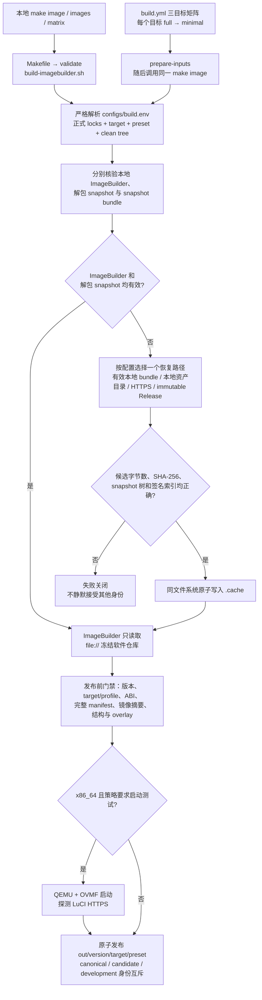
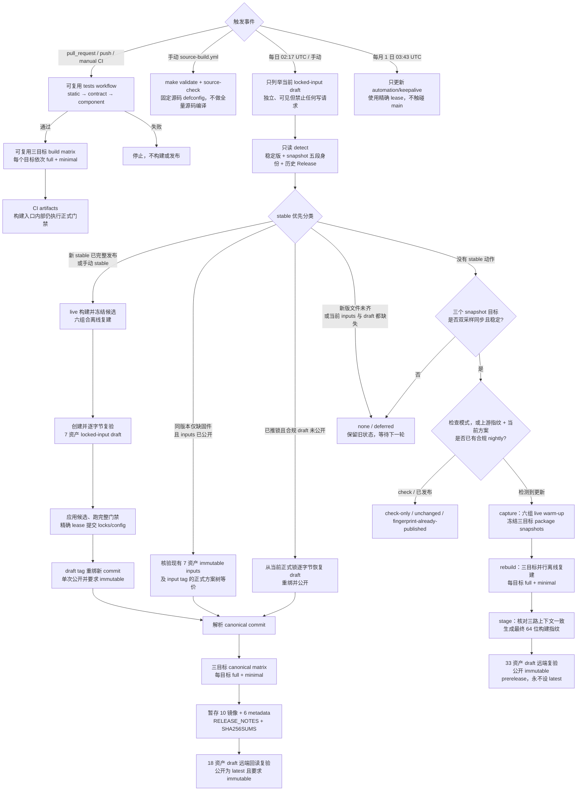
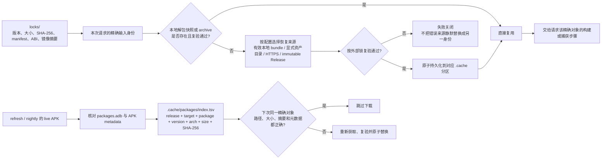

# 工程执行逻辑

本文用框图描述当前仓库的实际执行路径。图中的“通过”都不是只检查命令退出码：正式构建还会核对版本锁、输入字节、软件包 manifest、内核 ABI、镜像结构和发布身份。任一身份不完整或上游视图不同步时，流程失败关闭，不会降级成未锁定构建。

## 正式 ImageBuilder 构建信任链

production 的 `make image`、CI canonical 构建和 stable 发布共用 `scripts/build/build-imagebuilder.sh`，不会形成“本地一套、CI 另一套”的实现。环境变量只能覆盖已登记的配置键，不能注入任意 shell 内容。显式指定的恢复源若存在但身份错误会直接失败；不能依靠换下一个来源掩盖损坏或供应链漂移。

## 本地入口与策略边界

| 入口 | 实际策略 | 身份与输出 |
|---|---|---|
| `make test` | 离线执行 static → contract → component | 不生成固件 |
| `make image` / `images` / `matrix` | `configs/build.env`、正式冻结仓库、`enforce`、clean tree | canonical `out/` |
| `make test-build TEST_MODE=development` | 仍消费正式冻结仓库，只放宽 clean-tree 身份要求 | development `build/test-results/` |
| `make source-check` | locked tag/commit、隔离 detached worktree、固定 feeds，只执行 `defconfig` | 不生成正式镜像 |
| `make source` | 从同一固定源码实际编译 | 始终是 development |
| `make source-audit` | `configs/build-debug.env`：full history、always fetch、all kmods、诊断并保留工作树 | development |
| `make refresh-locks VERSION=...` | `configs/build-refresh.env`：stable live warm-up、冻结输入、离线复建 | candidate `build/lock-refresh/` |
| `make nightly` | `configs/build-nightly.env`：snapshot live warm-up、冻结输入、离线复建 | candidate `build/nightly/` |

`SOURCE_FETCH_MODE=full` 只在源码获取、`source-check` 或源码构建路径中生效；给普通 ImageBuilder 命令选择调试配置不会自动克隆源码。refresh 与 nightly 的 `record` 模式只能写入各自的指纹隔离目录，不可覆盖正式 `locks/` 或 stable `out/`。

## GitHub Actions 更新与发布编排

stable、nightly 和 locked-input Release 都采用相同事务边界：先创建 draft，确认 tag/commit 和资产集合，逐项从 GitHub 回读并比较字节，最后才公开；公开后必须看到 `immutable=true`。中断留下的合规 draft 可以恢复，已公开对象绝不使用 `--clobber` 回写。

这里还有四个重要边界：

- 新 stable 的三个目标文件或摘要尚未齐全时分类为 `deferred`，不会降级发布 nightly；
- 仅下游仓库 HEAD 前进并不触发发布，变化必须已经进入官方 `feeds.buildinfo`、实际 `packages.adb` 或同步的 snapshot 二进制视图；
- `SNAPSHOT_FINGERPRINT` 只是上游检测身份，nightly tag 使用的最终指纹还绑定当前 `PLAN_INPUTS.sha256` 和三份 portable snapshot 树；live warm-up 固件不会发布，只有冻结输入的离线复建结果能进入 nightly；
- Actions artifact 只有 14/90 天传递用途；immutable Release 才是 stable 输入恢复和 nightly 历史去重的耐久状态。

## 本地缓存、冻结输入与信任根

`.cache/` 只是可复用存储，不是信任根。canonical production 只消费正式锁指定的冻结 package snapshot，并关闭 rolling package-cache 解析；包索引主要服务于 refresh、nightly、调试和维护查询。要让旧版本在上游删除文件后仍可复建，必须保留对应 immutable locked-input Release 或其他与正式锁逐字节一致的归档。

## 主要输出与可恢复性

| 输出 | 身份 | 是否改变正式锁 | 持久恢复来源 |
|---|---|---:|---|
| `out/<stable>/...` | canonical | 否 | stable locks + 7 资产 locked-input Release |
| `build/lock-refresh/<version>/...` | candidate | 应用前否 | 审核 Artifact、候选快照与 ImageBuilder |
| `build/nightly/<final-fingerprint>/...` | nightly candidate | 否 | 33 资产 nightly Release 中的 7 个耐久输入及完整溯源 |
| 源码/调试输出 | development | 否 | 固定源码、feeds 与显式调试策略；不承诺 canonical 字节一致 |

任何构建若使用 dirty tree、额外包、live 仓库、调试开关或未正式应用的候选锁，都会与 canonical 身份分离，不能进入 stable Release。
